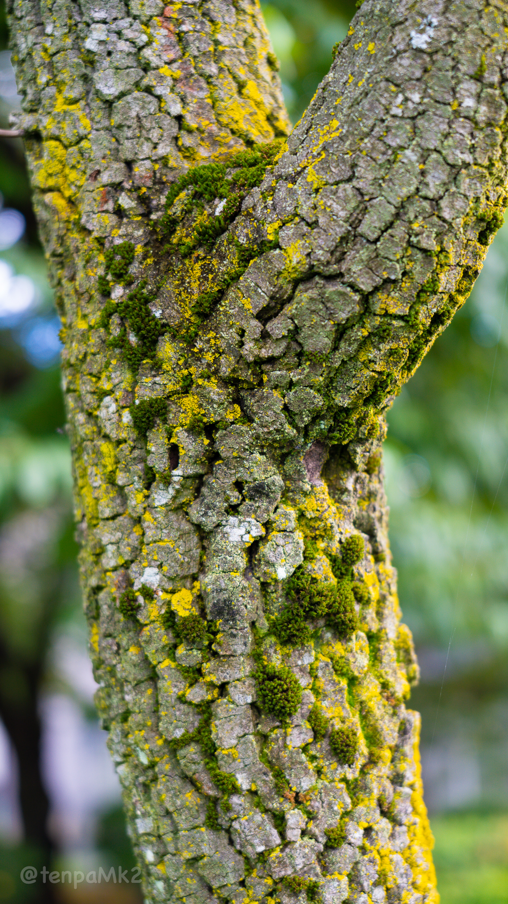

# image-conveter-for-instagram

Image converter for instagram

## Usage

```shell
npm install
```

Put your images into `inputs` directory.

```shell
npm run exe
```

You can see the help.

```shell
npm run help
```

## before-after

### before



### after


